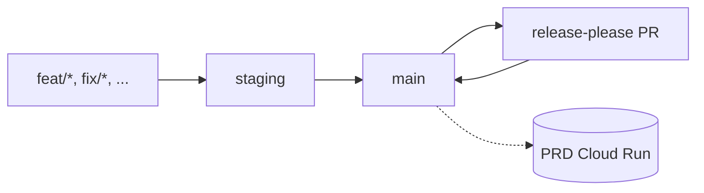
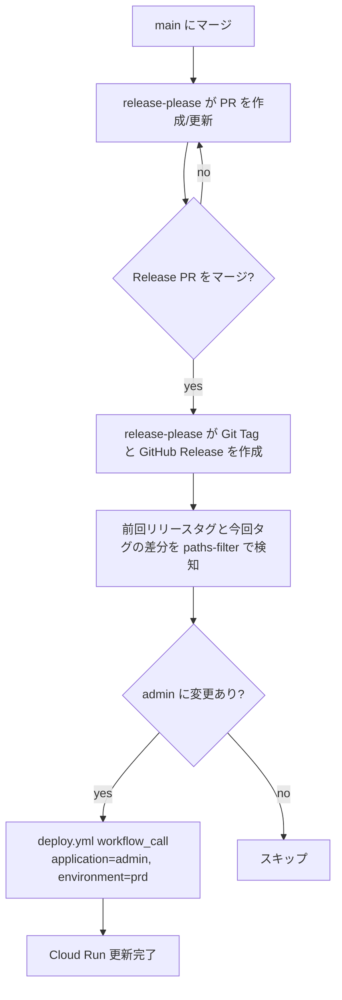

# ブランチ戦略とデプロイ運用

## 前提

- `main` は常に production にデプロイ可能な状態を維持する
- `staging` は STG 環境への事前検証用ブランチ
- Issue 駆動で `feat/*`, `fix/*`, `chore/*`, `infra/*`, `refactor/*` を切る
- リリースバージョニングは [release-please](https://github.com/googleapis/release-please) が管理する

## ブランチ構成



## 日常フロー

### 1. feature ブランチ

- 作業は `main` から切ったトピックブランチで行う
- PR を作成し、CI (`.github/workflows/ci.yml`), E2E (`.github/workflows/e2e.yml`), Terraform CI (`.github/workflows/terraform-ci.yml`) を通過させる
- 通常マージ先は `main`。事前検証が必要な場合のみ `staging` にマージする

### 2. staging ブランチ

- **本リポジトリでは staging ブランチは自動作成しない**。必要になった時点で以下の手順で作成する

  ```bash
  git fetch origin
  git push origin origin/main:refs/heads/staging
  ```

- STG 環境への自動デプロイは行わない。STG デプロイが必要なときは手動で workflow を実行する（下記「手動 STG デプロイ」参照）
- `staging` → `main` へのマージは PR 経由で行う

### 3. main ブランチ

- `main` への push は禁止、必ず PR 経由
- `main` にマージされると自動で以下の pipeline が走る:
  1. `release-please.yml` が Conventional Commits を集計して Release PR を作成 or 更新
  2. Release PR をマージすると `release-please.yml` が前回リリースタグと今回タグの差分を `dorny/paths-filter` で検知し、対象アプリケーションのみ `deploy.yml` を reusable 呼び出しする
  3. `deploy.yml` が Cloud Run サービスを更新する

## 自動 PRD デプロイフロー



### 現時点のスコープ

| アプリ | 自動デプロイ対象 | 備考 |
| --- | --- | --- |
| `admin` | はい (PRD) | Release PR マージで自動実行 |
| `reader` | いいえ | PRD デプロイは無効 (stg のみ) |
| `search-token-worker` | いいえ | 手動 workflow_dispatch のみ |

将来 `reader` / `search-token-worker` を自動化したくなった場合は `release-please.yml` の paths-filter に filter を追加し、`deploy-*-prd` job を matrix ではなく個別 job として追加する。

## Conventional Commits と release-please

release-please は以下の prefix を拾う (現状の `release-please-config.json` は `bump-minor-pre-major: true` / `bump-patch-for-minor-pre-major: false` 設定):

- `feat:` → minor bump / "Features" セクション
- `fix:` → patch bump / "Bug Fixes"
- `perf:` → "Performance Improvements"
- `refactor:` → "Code Refactoring"
- `docs:` → "Documentation"
- `chore:`, `deps:` → "Miscellaneous Chores" / "Dependencies"
- `BREAKING CHANGE:` フッター → 1.0.0 未満では minor bump / 1.0.0 以降は major bump

設定ファイル: `release-please-config.json`, `.release-please-manifest.json`

### 手動でバージョンを指定する

- 特定バージョンを出したいとき: commit message の body に `Release-As: 1.2.3` を追加
- バージョンを上書きする設定ファイル修正: `.release-please-manifest.json` を編集して PR

## 手動 STG デプロイ

STG 検証が必要なときは GitHub UI から workflow を実行する。

1. Actions → `Deploy to Cloud Run` → `Run workflow`
2. 入力
   - `application`: `reader` / `admin` / `search-token-worker`
   - `environment`: `stg`
   - `tag`: 省略時は `${GITHUB_SHA}`
3. `reader` + `prd` の組み合わせは workflow 側で拒否される

## 緊急時の PRD 手動デプロイ

release-please を経由せずに直接 PRD に出したい場合 (例: revert 用の hotfix):

1. Actions → `Deploy to Cloud Run` → `Run workflow`
2. 入力
   - `application`: `admin` (reader は PRD 不可)
   - `environment`: `prd`
   - `tag`: roll back 対象の git SHA か Artifact Registry のタグ
3. 実行後、事後対応として同じ修正内容の hotfix PR を `main` に出す

## Terraform CI と apply

`.github/workflows/terraform-ci.yml` は PR 時に `infrastructure/**` の変更を検知して以下を自動実行する:

1. `terraform fmt -check -recursive`
2. `tflint --recursive`
3. `terraform init` (gcs backend, matrix: stg/prd)
4. `terraform validate`
5. `terraform plan` + PR コメント (環境ごと)

PR コメントはマーカー `<!-- terraform-plan:stg -->` / `<!-- terraform-plan:prd -->` を使って update する。

> **注意**: 本リポジトリは公開リポジトリのため、PR コメント内の plan 出力にはプロジェクト ID やサービスアカウントのメールアドレスなど運用上の識別子が含まれる。これらは機密ではないが、公開したくない値を扱う場合は、Terraform 側で `sensitive = true` を付けるか、plan を投稿せず artifact として限定的に共有する運用に切り替えること。

### terraform apply

`apply` は手動で実施する。

```bash
cd infrastructure/environments/prd
terraform init
terraform plan
terraform apply
```

`main` マージ前に plan コメントを review し、承認を得てから apply する運用とする。

## 参考

- Conventional Commits 仕様: <https://www.conventionalcommits.org/>
- release-please 公式: <https://github.com/googleapis/release-please>
- dorny/paths-filter: <https://github.com/dorny/paths-filter>
