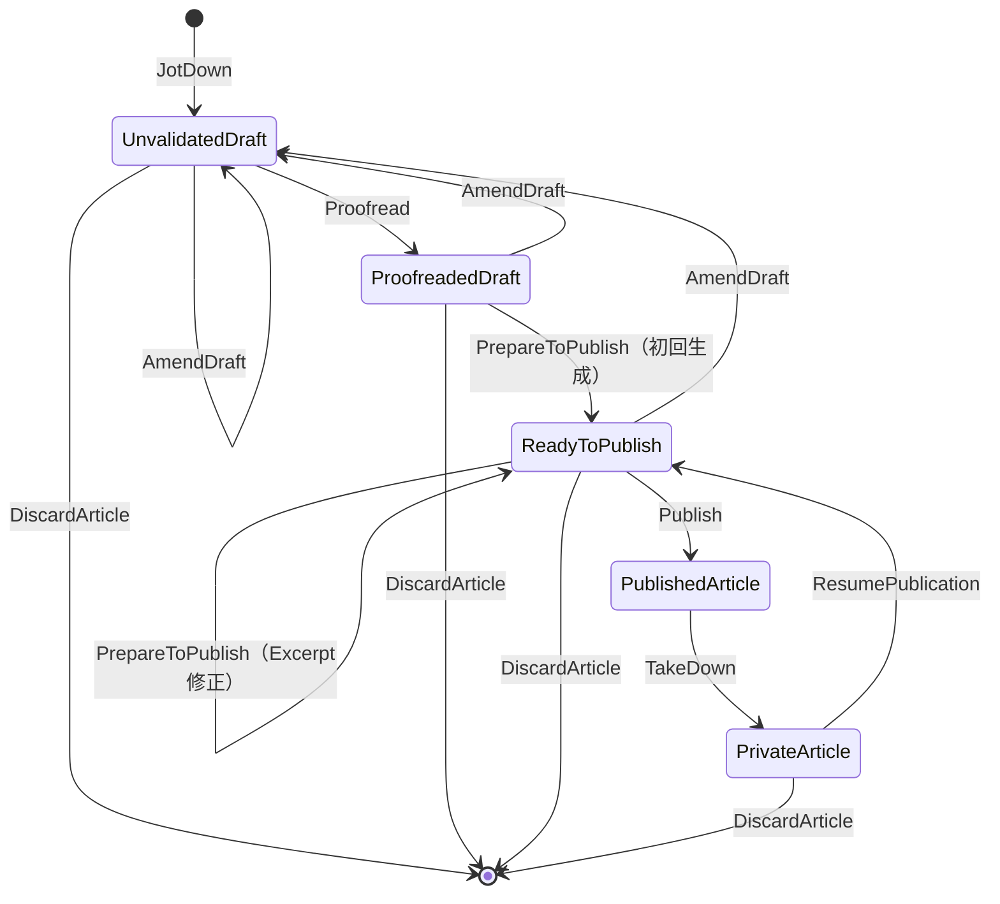

# Article ドメインモデルとユースケース

最終更新: 2026-09-19

本資料は共同モデリングで合意したMVPの仕様をまとめる。
設計上の確定事項と現在の実装は一致していない。実装完了を示す資料ではない。
更新系ユースケース名は確定済み。型の具体的な配置や読み取り系の命名など、
未確定の実装事項は末尾に分けて記載する。

## 1. 対象と責務

- 管理者は一人。記事の作成、編集、校正完了、プレビュー、公開、非公開、削除を行う。
- 読者には公開記事だけを提供する。
- ドメインは純粋な値・不変条件・状態遷移を扱う。DB、AI、HTTP、乱数取得に依存しない。
- ユースケースはCommandを受け、必要な依存関数を使い、Resultを返す。
- すべての層の処理エラーはDomainErrorに統一し、Presentation層が適切な応答へ変換する。
- イベント配信はユースケース外のPresentation側で調整する。
- 画像集約と画像の利用情報はMediaコンテキストが所有する。

識別子の型名はXxxIdentifierとする。集約自身の識別子フィールドはidentifier、
他集約への参照フィールドはarticleなどの業務名とする。
検証付き構築関数はnewXxxとし、mk接頭辞を使わない。

## 2. ライフサイクル



- 公開記事と非公開記事は直接編集できない。
- 公開記事を編集する場合は、非公開にしてから公開準備済みの下書きに戻す。
- PrivateArticleからPublishedArticleへ直接遷移しない。
- 非公開から戻した直後はReadyToPublishで、Excerptを保持する。
- 編集保存は差分比較をせずUnvalidatedDraftに戻し、Excerptを無効化する。
- Excerptだけの修正はPrepareToPublishで扱い、ReadyToPublishを維持する。
- AI生成完了だけでは公開しない。管理者がプレビュー後に明示的にPublishする。

## 3. 集約と値オブジェクト

### 状態ごとの保持情報

| 型 | 保持する情報 |
| --- | --- |
| UnvalidatedDraft | 記事識別子、Title、DraftBody、任意のSlug、タグ、画像参照、Timeline |
| ProofreadedDraft | 記事識別子、Title、Content、必須のSlug、タグ、確認済みの画像参照、Timeline |
| ReadyToPublish | 記事識別子、PublicationContent、Timeline |
| PublishedArticle | 記事識別子、PublicationContent、Timeline、publishedAt |
| PrivateArticle | 記事識別子、PublicationContent、Timeline、最後のpublishedAt |

PublicationContentはTitle、Content、Slug、Excerpt、タグ、画像参照をまとめる。
記事識別子・日時は含めない。ReadyToPublish、PublishedArticle、PrivateArticleが
これを保持し、公開記事の中に「draft」という名前のデータを置かない。
同じ情報をメタデータとPublicationContentに重複して保持しない。

### 値の制約

| 概念 | 制約 |
| --- | --- |
| ArticleIdentifier | Slugと独立したULID。生成に必要な乱数取得はドメイン外 |
| Title | 必須。空文字・空白のみを禁止。最大100文字 |
| DraftBody | 空文字・空白のみを許容。未入力は空文字に統一しMaybeにしない |
| Content | 空文字・空白のみを禁止。ドメインとして文字数上限を設けない |
| Slug | 英小文字・数字をハイフンで区切る。先頭・末尾・連続ハイフンを禁止 |
| Excerpt | 必須。空文字・空白のみを禁止。最大200文字 |
| タグ | 任意。タグなしで校正完了・公開できる |
| ImageReference | Article側の画像参照。Mediaの画像集約そのものを保持しない |
| Timeline | createdAtとupdatedAt。作成日時を維持し、更新・遷移で更新日時を設定 |

リクエストサイズ上限はドメインの本文文字数制約とは別に境界で扱う。
タグの詳細な形式制約や上限数は今回の議論では新たに決定していない。

### DataKindsによる状態の区別

次は型の関係を示す骨格であり、実装済みコードではない。

```haskell
data DraftPhase = Unvalidated | Proofreaded | Ready

data Draft (phase :: DraftPhase) where
    -- 各段階に必要なデータを持つ非公開コンストラクタ

type UnvalidatedDraft = Draft 'Unvalidated
type ProofreadedDraft = Draft 'Proofreaded
type ReadyToPublish = Draft 'Ready
```

DraftPhaseは実行時の状態フラグではなく、操作の入出力を制限する型の添字。
コンストラクタを非公開にして、検証付き構築関数と遷移関数を通して作る。
UnvalidatedDraftもTitleと指定済みSlugは検証済みであり、「すべて未検証」ではない。

## 4. 保存・Slug・日時

### 編集保存

UIは変更がない場合の保存を抑制する。バックエンドは保存要求を一律に更新とみなす。
同じ値でもupdatedAtを更新し、通常の下書き編集ではExcerptを無効化する。

AmendDraftはタイトル・本文・Slug・タグを全置換する。
部分更新ではないため、本文を空にする、Slugを未指定にする、タグを外す意図を
省略との区別なく表現できる。画像一覧とExcerptはこの入力に含めない。

### Slug

- 下書き保存時は未指定を許可するが、指定値の形式は保存時に検証する。
- 校正完了時は必須。
- 指定して保存した時点で、全記事状態を通じて一意に確保する。
- 使用状況確認APIでUIに事前案内する。編集対象の記事自身は重複扱いにしない。
- 事前確認だけに依存せず、保存時にもインフラ層が一意性を原子的に保証する。
- 衝突時はDomainErrorを返す。確認から保存までの競合も対象。
- 公開履歴に関係なく下書き編集時に変更可能。
- 変更・物理削除の成功時に旧Slugを解放し、再利用可能にする。
- 旧URLのリダイレクトは設けない。旧URLが後に別記事を指すことも許容する。
- PublicationHistory、公開済みSlugの変更禁止、使用済みSlugの永久予約は設けない。

### 日時

- createdAtは初回作成時から維持する。
- 更新・遷移のtimestampはCommandから渡す。ドメイン内で現在時刻を取得しない。
- publishedAtは公開・再公開のたびに、その公開日時に設定する。
- PrivateArticleは最後の公開日時を保持する。
- 公開履歴を判定するための情報を下書きに追加しない。

## 5. CommandとResult

共通CommandはShared.UseCase.Commandを使う。

```haskell
data Command payload = Command
    { payload :: payload
    , timestamp :: UTCTime
    , actor :: Actor
    , correlation :: CorrelationIdentifier
    , causation :: Maybe Causation
    }
```

読み取り系もCommandに統一する。各ユースケースはDomainErrorを失敗経路に持ち、
成功時は「ユースケース名 + Result」を返す。
更新系Resultは更新後の集約または処理結果と、型付きのイベント列を含める。
削除では削除済み記事を現存する集約として返す必要はない。具体的な結果項目は実装設計で決める。

イベントの許可集合を型族・Eventsで制約する。
Events '[ArticlePublished]は許されるイベント型を制限するが、
空でないことやちょうど1件であることまでは保証しない。必要件数は構築経路とテストでも保証する。
イベントなしはEvents '[]。読み取り系も同じ扱いとする。

| ユースケース | 主なpayload | 成功結果 | イベント |
| --- | --- | --- | --- |
| JotDown | タイトル・本文・任意Slug・タグ | JotDownResult: UnvalidatedDraft | ArticleDraftStarted |
| AmendDraft | 対象article・全編集項目 | AmendDraftResult: UnvalidatedDraft | ArticleDraftAmended |
| Proofread | 対象article | ProofreadResult: ProofreadedDraft | ArticleProofreaded |
| PrepareToPublish | 対象article・Excerpt | PrepareToPublishResult: ReadyToPublish | 初回のみArticleReadyToPublish |
| Publish | 対象article | PublishResult: PublishedArticle | ArticlePublished |
| TakeDown | 対象article | TakeDownResult: PrivateArticle | ArticleTakenDown |
| ResumePublication | 対象article | ResumePublicationResult: ReadyToPublish | なし |
| DiscardArticle | 対象article | DiscardArticleResult: 削除結果 | ArticleDiscarded |

JotDownはタイトルだけでも保存可能。識別子はユースケース側で生成して純粋関数へ渡す。
Proofreadはユーザーの完成判断を確定する操作で、自動文章校正ではない。
PrepareToPublishは初回生成の適用と手動修正を一つのユースケースで扱う。
内部の純粋関数を状態別に分けることはできるが、AmendExcerptという別ユースケースは作らない。
手動修正では再校正・再生成を行わず、updatedAtを更新する。

## 6. 非同期Excerpt生成

1. Proofreadは必須項目と管理対象画像の利用可能性を確認して校正済みとして保存する。
2. ArticleProofreadedに生成対象のタイトル・本文を含める。
3. ドメイン外のEnvelopeに、生成対象の記事リビジョンを付与する。
4. コンシューマーがAIにExcerpt生成を依頼する。失敗時は再試行する。
5. 生成完了イベントにExcerptと元の対象リビジョンを引き継ぐ。
6. 現在も校正済みで対象リビジョンが一致する場合だけ、生成結果を適用する。

照合と保存はインフラ層で原子的に実行する。途中の編集や重複配送で上書きしない。
古い生成結果は手動修正済みのExcerptにも適用しない。
イベント形式のschemaVersionや生成完了イベントの到着順では新旧を判定しない。

ArticleVersionやProofreadingIdentifierはドメインに追加しない。
ExcerptGenerationFailedというドメイン状態・イベントも追加しない。
生成完了イベントの具体名とEnvelopeの具体的な型拡張は未確定。

## 7. 画像とMedia連携

- 画像アップロード後、エディタが配信URLをMarkdown本文へ挿入する。
- 画像参照の正本は本文。クライアントから独立した画像一覧は受け取らない。
- バックエンドが本文から管理対象画像の参照を抽出する。
- Article側の型には画像参照を保持し、本文との整合性を構築経路で保証する。
- 下書き保存は画像の利用準備が未完了でも可能。
- 校正完了時は、管理対象画像がすべて利用可能であることをユースケースで確認する。
- 純粋な校正関数に確認済み情報を渡し、対象記事の参照集合との一致を保証する。
- 外部画像URLの埋め込みを許可する。Mediaの管理・利用可能性確認の対象にはしない。
- 画像なしでも公開可能。アイキャッチ画像は必須にしない。
- 下書き・非公開の記事も画像を利用中と扱い、非公開化だけで参照解除しない。

| イベント | Media向け参照情報 |
| --- | --- |
| ArticleDraftStarted | 記事への参照と保存後の管理対象画像一覧 |
| ArticleDraftAmended | 記事への参照と更新後の管理対象画像一覧。空集合も通知 |
| ArticleDiscarded | 削除した記事への参照 |

Articleは記事の事実を通知し、Media側がImageUsageへ変換する。
記事削除と同時に画像を直接削除しない。参照解除後の保持・削除はMediaが担当する。
イベント順序の逆転や削除後の古い通知で利用情報を復活させない。

## 8. イベントと保存の境界

DomainEventは業務payloadだけを持つ。
identifier、occurredAt、actor、correlation、causationはSharedのEnvelopeで扱う。
記事リビジョンはドメイン外のメタデータとして追加設計する。

既存の[ADR-004](../adr/004-domain-event-routing-and-projection.md)に従い、
集約保存とoutbox追加は原子的に実行し、ユースケース自身はQueueへ配信しない。
「保存してからResultのイベントを直接送信する」だけでは欠落するため、この構成にはしない。
具体的なトランザクション境界・依存関数の署名は実装前に整える。

次の識別情報は役割を混同しない。

| 情報 | 役割 |
| --- | --- |
| EventIdentifier | イベント配送の冪等化 |
| 対象記事リビジョン | AI生成結果の適用条件 |
| ProjectionEnvelope.sourcePosition | Media投影の更新順序 |
| schemaVersion | イベント形式の互換性。今回具体的な導入は決めていない |

## 9. 読み取りとUI

| 読み取り | 条件 |
| --- | --- |
| 管理用一覧 | updatedAt降順。下書き3段階・公開・非公開の各状態で絞り込み |
| 管理用詳細 | 全状態を管理者のみ取得可能。プレビューにも使用 |
| Slug使用状況 | 自分の記事を除いた使用状況を確認 |
| 読者用一覧 | 公開記事のみ。publishedAt降順 |
| 読者用詳細 | 公開記事のみ。下書き・非公開は存在しない場合と同じ扱い |

両一覧にページングを設け、同時刻の記事も安定するよう記事識別子を第2の並び順にする。
管理用一覧では下書きの3段階を表示する。再公開で読者用一覧の先頭側へ移る。
管理用一覧の状態フィルターは「すべて」またはUnvalidated・Proofreaded・ReadyToPublish・Published・Privateのいずれか1つとする。
ページングはShared.Domain.Pagerを利用するページ番号方式とする。
Commandで現在ページと1ページの件数を受け取り、Resultに記事一覧とPagerを含める。
現在ページと1ページの件数は1以上、総件数は0以上とする。
検索結果が0件でも1ページ目を要求でき、空の記事一覧を返す。
Pagerは現在ページ0・件数0を拒否する。Intの範囲を超えるoffsetもDomainErrorで拒否する。
最終ページを超えた要求はエラーや自動補正にせず、空の記事一覧を返す。
その場合もPagerには要求された現在ページと実際の総件数を保持する。
管理用・読者用ともに1ページの件数は既定10件、上限100件とする。
指定可能な範囲は1〜100件で、範囲外は自動補正せずDomainErrorを返す。
管理用は(updatedAt DESC, identifier DESC)、読者用は(publishedAt DESC, identifier DESC)で並べる。
同じ日時の記事も記事識別子の降順で順序を確定する。
読み取りユースケースは以下の名前とする。入力はCommand、出力は各ユースケース名にResultを付けた型とする。

| ユースケース | 利用目的 |
| --- | --- |
| BrowseArticlesForAdmin | 管理対象の記事を一覧する |
| ViewArticleForAdmin | 編集・プレビュー用に記事を確認する |
| BrowseArticlesForReader | 公開記事を一覧する |
| ReadArticle | Slugで公開記事を読む |
| CheckSlugAvailability | 候補のSlugが使用可能か確認する |

一覧用のSummary型は作らず、管理用一覧はArticle、読者用一覧はPublishedArticleを返す。
どちらも本文を含む集約全体を返し、画面に必要な項目の選択・整形はBFFが担当する。
MVPではArticleからBFFへの本文の取得・転送コストを許容する。
公開範囲の制約はBFFに委譲せず、Article側で読者用の取得対象を公開済みに限定する。

詳細取得は管理用と読者用の別ユースケースとし、いずれもCommandを入力とする。
管理用はArticleIdentifierで検索し、全状態のArticleを取得する。編集・プレビューに利用する。
読者用はSlugで検索し、PublishedArticleだけを取得する。
読者用では下書き・非公開・存在しない記事を区別せず、見つからないものとして扱う。
詳細の画面向け整形もBFFが担当する。

Slug使用状況の確認は下書き作成後に行う。
入力には候補のSlugと対象記事への参照article :: ArticleIdentifierを必須とし、Maybeにはしない。
対象記事自身を除いた全状態の記事について、候補のSlugが使われているか確認する。
確認結果はSlugの予約ではなく、保存時には別途一意性を保証する。
対象記事が存在しない場合はAggregateNotFoundを返し、利用可能とは回答しない。
Slugの正常な確認結果はAvailable | InUseのADTで表す。
使用中はエラーではなく確認結果とし、不正なSlug・対象記事なし・取得失敗はDomainErrorで返す。

## 10. 削除とMVP対象外

削除可能なのは全段階の下書きと非公開記事。公開中の記事は先にTakeDownする。
物理削除し、復元機能は設けない。Slugは解放する。

MVP対象外:

- AIによるExcerpt再生成ボタン。将来候補として残す。
- AIによる文章の自動校正。
- 予約公開。
- 第三者向けプレビュー共有URL。
- 削除記事の復元。
- 旧Slugからのリダイレクト。

初回Excerpt生成の失敗時の再試行と、生成後の手動修正はMVPに含む。

## 11. 先行実装との差分（整備着手前）

2026-09-19の設計資料作成時点で確認した差分。実装整備後の進捗は下記を参照。

| 現在の実装 | 合意した変更 |
| --- | --- |
| Common.hsのContentが最大10,000文字 | ドメインの上限を撤廃 |
| DraftInputの本文がMaybe Text | DraftBodyの空文字に統一 |
| DraftInputが独立したimagesを受け取る | 本文からバックエンドで導出 |
| 未校正Draftが生のDraftInputを保持 | Titleと指定されたSlugは保存時点で検証済みにする |
| SharedのSlugが英大文字・端や連続ハイフンを許可 | 合意したArticleのSlug制約を実装 |
| SharedのExcerptが最大100文字で空白のみを許可 | 最大200文字、空白のみ禁止 |
| ArticleDataとoriginalInputを保持 | 合意した段階別データとPublicationContentへ整理 |
| Published/PrivateがReadyToPublishをdraftとして保持 | PublicationContentを保持 |
| Private.reviseArticleが直接未校正にする | ResumePublicationを経由し、AmendDraftで編集 |
| PrepareToPublishが初回適用のみ | 同ユースケースにExcerpt修正も含める |
| Domain.Eventが3イベントのみで本文snapshotを含まない | 合意した8ユースケースのイベント契約へ整理 |
| UseCase.Post/PostResultが存在 | Publish/PublishResultに置換 |
| JotDown、TakeDownが空モジュール | 合意したCommandとResultで実装 |
| 保存とイベント返却だけのPost | Outboxとの原子的保存を設計 |
| EventEnvelopeに対象リビジョンがない | ドメイン外に追加する方法を設計 |
| 先行テストに旧文字数制限・直接編集の前提がある | 合意した契約へ更新 |

### ドメイン整備の進捗

値オブジェクト、DraftContent / ProofreadedContent / PublicationContent、
DataKindsとGADTによるDraft、公開・非公開集約、純粋な遷移関数を実装した。
本文上限の撤廃、Slug形式、Excerpt最大200文字、全文置換による準備の無効化、
Excerpt単独修正、非公開からの公開準備再開を反映した。

検証済みの型はコンストラクタと更新可能なフィールドを非公開とし、
HasFieldによる読み取り専用アクセスを提供する。
コンストラクタだけを隠してフィールドを公開すると、レコード更新で検証を迂回できるためである。
Timelineも同じ理由で読み取り専用とする。

画像抽出はExtractImageReferencesという純粋な依存関数を通し、
newDraftContentが対象の本文を渡して画像参照を導出する。
AvailableImageReferencesはユースケースが取得した確認結果から構築し、
校正時にも対象Draftの参照集合と一致することを検証する。
実際のMarkdown解析とMediaへの問い合わせは次段階で接続する。

ドメイン整備のPRではドメインとテストのみをArticleパッケージとして追加する。
ローカルの先行実装にあるPostや未完成のAPIは含めない。
ユースケース・イベント・Outbox・API実装は未完了であり、
これらを完成済みとして扱わない。

検証コマンド:

```sh
bash applications/backend/article/scripts/check-domain.sh
```

分割ユニットテスト、Articleドメインの式カバレッジ90%以上、
不正な公開・coerceによる段階変更・本文の直接レコード更新がコンパイルできないことを検証する。
カバレッジの対象は今回整備したDomain.Article配下とDomain.Articleであり、
未整備のユースケース・Presentationを含むサービス全体の値ではない。

### JotDown / AmendDraft の実装

後続ブランチでJotDownCommand / JotDownResultとAmendDraftCommand / AmendDraftResultを実装した。
ArticleEventsFor型族により、それぞれArticleDraftStarted、ArticleDraftAmendedだけを返せる。
イベントpayloadは記事への参照と管理対象画像の全件集合を持つ。
空集合も通知し、画像をすべて外す編集を表現する。

JotDownは入力検証・画像参照抽出の成功後に識別子を生成し、
新規下書きのPersistとOutbox追加を同じTransaction内で実行する。
AmendDraftは記事を取得して状態を確認し、下書きの3段階のみを編集する。
Published / Privateは拒否する。全置換後は常にUnvalidatedDraftとなる。

永続化はDomain.Articleの関数型を注入する方式へ移行した。
詳細は[TransactionManager設計](article-transaction-manager.md)を正とする。
TransactionManagerと具体アダプターには以下を要求する。

- Slugの一意性、記事の保存、Envelopeを付けたOutbox追加を原子的に実行する。
- 新規保存では既存識別子へのupsertを禁止する。
- 編集保存では取得時の識別子・リビジョンに対する条件付き保存を行う。
- 失敗時に一部だけ保存しない。削除された記事を再作成しない。
- 保存中にQueueへ配信しない。Resultのイベントを別途直接送信して二重配信しない。

FindArticleはArticleだけを返し、PersistArticleはArticleを受け取る。
インフラ実装は取得時のリビジョンを同一トランザクションの内部文脈に保持するため、
ArticleやCommand payloadにArticleVersionを追加しない。
Commandのtimestamp・actor・correlation・causationはCommand ()へ引き継ぎ、
保存アダプターがOutboxのEnvelopeを構築する際に利用する。

ユニットテストでは依存関数を差し替え、入力拒否時の保存抑止、
全下書き状態からの編集、公開・非公開の拒否、画像参照全件、
メタデータの引き継ぎ、保存失敗・Slug競合・同時更新エラーの伝播を検証する。
検証スクリプトはドメインと実装済みユースケースそれぞれに式カバレッジ90%以上を要求する。
本番DBアダプター・実際のMarkdownパーサ・Media問い合わせ・HTTP APIは未実装であり、
実際のトランザクションの原子性を検証したものではない。

### Proofread / PrepareToPublish の実装

ProofreadはUnvalidatedDraftのみを受け付け、管理対象画像の利用可能性を確認して
ProofreadedDraftへ遷移する。画像参照が空ならMedia問い合わせは行わない。
ArticleProofreadedには検証済みのタイトルと本文のsnapshotを含め、
集約とイベントを保存してからProofreadResultを返す。

PrepareToPublishCommandのpayloadはApplyGeneratedExcerptとReviseExcerptに分ける。
前者はProofreadedDraftに生成結果を適用し、ArticleReadyToPublishを1件返す。
後者はReadyToPublishのExcerptのみを修正し、イベントは返さない。
生成由来か手動修正かはユースケースの入力で区別し、ドメインの状態には追加しない。

生成結果用の取得関数は、コンシューマーがEnvelopeの対象リビジョンに束縛する。
取得時と保存時の両方でリビジョンを照合し、最新リビジョンへの読み替えは禁止する。
校正時のOutboxには保存後の対象リビジョンを付ける必要がある。
リビジョンはInfrastructureのトランザクション文脈とEnvelopeの関心事であり、
ドメイン集約やCommandには持たせない。不一致はProcessingTargetChangedで区別する。

分割ユニットテストで状態制約、入力検証、画像確認、イベントとメタデータ、
保存失敗を検証する。メモリ上の条件付き保存アダプターでは、再校正後の古い結果、
取得から保存までの編集、重複配送、手動修正後の遅延結果を拒否し、
記事とOutboxが変更されないことを検証する。
これは実際のD1トランザクションやQueue配送を検証するfeatureテストではない。
AI生成・Media問い合わせ・永続化・配信の実アダプターは未実装である。

### Publish / TakeDown の実装

PublishCommandは対象articleを受け取り、ReadyToPublishからのみ公開する。
publishedAtとupdatedAtにはCommandのtimestampを設定し、createdAtとPublicationContentを保持する。
非公開から公開準備を再開した記事も同じ経路で公開し、publishedAtを今回の公開日時に更新する。
PrivateArticleからの直接公開や、公開済み記事への再度のPublishは拒否する。

TakeDownCommandは対象articleを受け取り、PublishedArticleからのみ非公開化する。
updatedAtを更新し、createdAt、直近のpublishedAt、本文・Excerpt・画像参照を含む
PublicationContentは保持する。Mediaの参照解除は行わない。

PublishResultはArticlePublished、TakeDownResultはArticleTakenDownをそれぞれ1件含む。
両イベントのpayloadは記事への参照のみで、時刻やactorはEnvelopeで扱う。
型族は返せるイベントの種類を制限し、件数はユニットテストで保証する。
ユースケース内からQueueへの配信や公開ログ出力は行わない。

FindArticle・PersistArticle・型付きOutbox追加を同じTransaction内で合成する。
取得時の識別子とリビジョンはInfrastructure内部で追跡し、条件付き更新に使用する。
保存が失敗した場合はDomainErrorを返し、成功Resultを返さない。
分割ユニットテストで全状態の許可・拒否、時刻の逆行、再公開、取得失敗、
識別子不一致、保存失敗、メタデータとイベントの引き継ぎを確認する。
イベント取り違えのコンパイル失敗も検証する。実際のD1・Queue接続は未実装である。

### ResumePublication / DiscardArticle の実装

ResumePublicationはPrivateArticleのみを受け付け、保持していたPublicationContentから
ReadyToPublishへ戻す。本文・Excerpt・Slug・画像参照・createdAtを保持し、updatedAtを更新する。
公開は行わない。ResumePublicationResultのeventsはEvents '[]とし、イベントを含められない。
PersistArticleは同じトランザクション内で追跡した取得時のリビジョンで更新し、競合を拒否する。

DiscardArticleは全段階の下書きとPrivateArticleを受け付け、PublishedArticleは拒否する。
DiscardArticleResultは削除した記事への参照とArticleDiscardedを1件含む。
削除後の集約や論理削除状態は作らない。存在しない記事への要求はAggregateNotFoundを返す。

TerminateArticleとOutbox追加を同じTransaction内で合成し、
記事の物理削除・Slugの解放・Outbox追加を原子的に実行する契約である。
読み取り後に公開された記事を削除しないよう、削除時にもリビジョンを照合する。
Mediaへの参照解除や画像削除は直接行わず、ArticleDiscardedのコンシューマーが担当する。
失敗時には削除結果を返さず、DomainErrorを伝播する。

test/unit配下の専用ファイルで全状態、取得失敗、識別子不一致、保存・削除失敗、
メタデータ、イベント数、再公開準備時の内容保持と日時を検証する。
再公開準備へのイベント追加と、削除イベントの取り違えはコンパイル失敗テストで検証する。
実際の物理削除・一意制約解放・Outboxの原子性は、本番DBアダプターとfeatureテストで検証する。

## 12. 実装前の残事項と検証条件

### 読み取りユースケースの実装状況

合意した5ユースケースを実装した。各入力はCommand、各Resultのeventsは型族でEvents '[]となる。
管理用詳細は全状態を返し、読者用詳細は非公開状態と未存在を同じAggregateNotFoundにする。
Slug使用状況は対象記事の存在と識別子を確認し、全状態を対象とする所有者照会の結果から
自分の記事を除外してAvailable / InUseを返す。確認は予約ではなく、後続の保存時の一意性保証は必須。

一覧の依存関数は状態条件・ページ番号・件数を含む検証済みCriteriaを受け取り、
総件数と対象ページの集約を一緒に返す。検索関数型はDomain.Articleに定義する。
取得アダプターは同じスナップショット・同じ絞り込み条件で集計と取得を行い、
規定の日時・識別子の降順で並べた後にoffset / limitを適用する。
ユースケースでは件数と総件数の整合性を検証し、管理用は取得結果の状態も確認する。
読者用一覧の依存関数の返却型はPublishedArticleに限定する。
画面用Summaryは作らず、本文を含む集約全体を返す。

Pagerは読み取り専用のアクセサを公開し、レコード更新による検証回避を防ぐ。
最終ページ計算は浮動小数点数を使わず、整数演算で行う。
既定10件・上限100件はArticleの入力契約であり、共通Pager自体に100件上限は設けない。

分割ユニットテストでページ境界・入力不正・全状態の絞り込み・非公開情報の非返却・
Slugの自己除外・依存関数の失敗を検証する。5つの読み取りResultへのイベント追加は
コンパイル失敗テストで検証する。読み取り系とPagerにも個別に式カバレッジ90%以上を要求する。
認証済みの呼び出し境界、実DBでの並び順・スナップショット・一意性、HTTP契約は未接続であり、
実アダプターとfeatureテストでの検証を残す。

業務ルールを変更せず、以下を実装設計で具体化する。

- 型・モジュール配置、確認済み画像情報の構築境界。
- Markdownパーサと管理対象URLの識別方法。
- 読み取りアダプターでのスナップショットと安定した順序の実現。
- リビジョン付きEnvelope、生成完了イベント、競合時の再試行・破棄の扱い。
- Slugの一意制約とOutboxを含む原子的な永続化契約。
- SharedのSlug/Excerpt変更が他コンテキストに与える影響。
- HTTP契約、認証、検索・公開ページへの反映先との連携。

実装時はtest/unit/**に領域ごとに分割したユニットテストを配置し、
カバレッジ90%以上を測定する。
featureテストはtest/featureに配置し、DockerとWranglerで実接続を検証する。

最低限の検証対象:

- 全状態の許可遷移と禁止遷移、再公開時の日時。
- タイトル・本文・Slug・Excerptの境界値。
- 保存要求による一律更新とExcerpt無効化、Excerptのみの修正。
- Slug競合、自己除外、変更・削除後の再利用。
- 生成中の編集、古い生成結果、重複配送、手動修正との競合。
- 本文と画像参照の一致、利用可能性確認、非公開時の参照維持、削除後の順序逆転。
- 公開以外の読者向け取得拒否、一覧の順序とページング。

## ドメイン共通基盤の追加

- Domain.ArticleにFind/Persist/Terminateと検索関数の型を配置する。
- Domain.Article.Criteriaは状態条件・ページ番号・取得件数を保持し、既定10件・上限100件で検証する。
- Domain.Article.Eventに記事イベントと純粋なpayload構築を配置する。
- Shared.Domain.Common.Primitiveに非公開コンストラクタのPositiveIntegerを定義する。
  生の数値は境界で検証し、Num/Read/coerceによる検証の迂回を許可しない。
- Shared.Domain.Common.Transactionはトランザクション抽象と純粋な処理合成だけを公開する。
  実行器・バージョン追跡・ユースケース接続は後続のユースケースPRで実装する。
- Shared.Domain.ErrorにProcessingTargetChangedとTransactionOutcomeUnknownを追加し、
  既存MediaのHTTPエラー変換も追随する。

このPRのテストはドメイン・Criteria・Pager・正数型を対象とする。
実DBトランザクションの原子性やOutboxの配信を検証したものではない。
