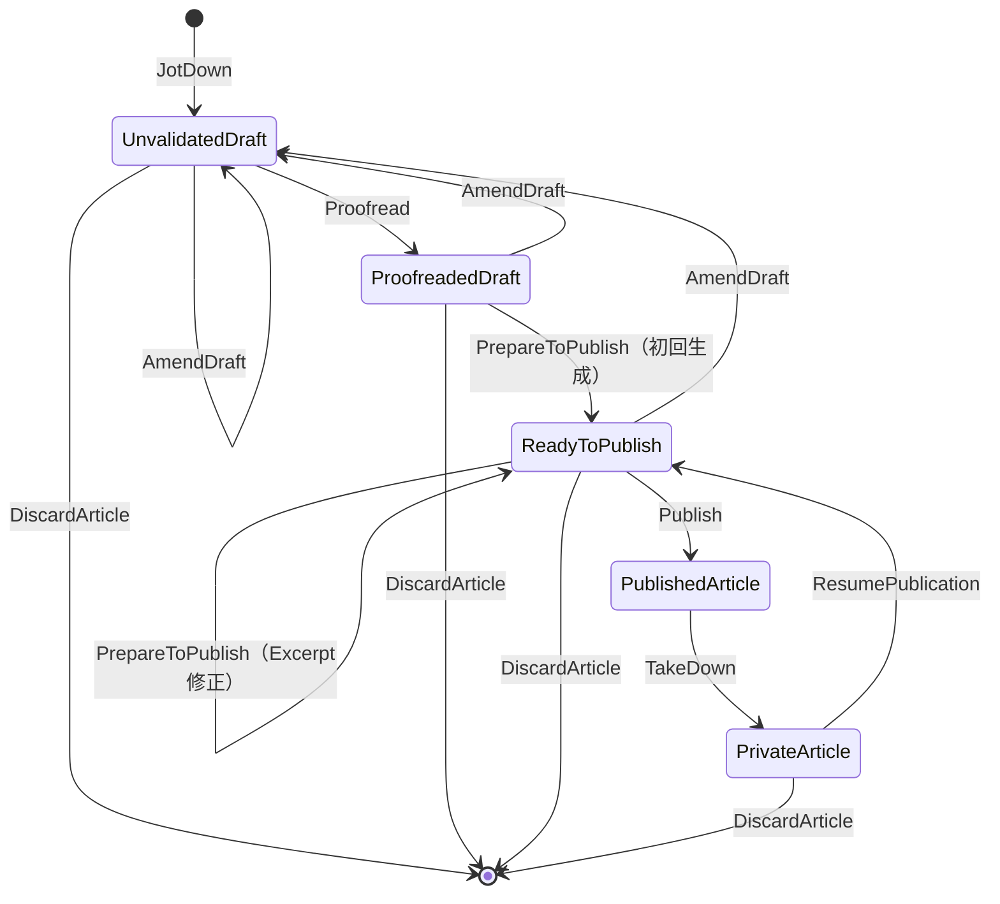

# Article ドメインモデルとユースケース

最終更新: 2026-09-19

本資料は共同モデリングで合意したMVPの仕様をまとめる。
設計上の確定事項と現在の実装は一致していない。実装完了を示す資料ではない。
更新系ユースケース名は確定済み。型の具体的な配置や読み取り系の命名など、
未確定の実装事項は末尾に分けて記載する。

## 1. 対象と責務

- 管理者は一人。記事の作成、編集、校正完了、プレビュー、公開、非公開、削除を行う。
- 読者には公開記事だけを提供する。
- ドメインは純粋な値・不変条件・状態遷移を扱う。DB、AI、HTTP、乱数取得に依存しない。
- ユースケースはCommandを受け、必要な依存関数を使い、Resultを返す。
- すべての層の処理エラーはDomainErrorに統一し、Presentation層が適切な応答へ変換する。
- イベント配信はユースケース外のPresentation側で調整する。
- 画像集約と画像の利用情報はMediaコンテキストが所有する。

識別子の型名はXxxIdentifierとする。集約自身の識別子フィールドはidentifier、
他集約への参照フィールドはarticleなどの業務名とする。
検証付き構築関数はnewXxxとし、mk接頭辞を使わない。

## 2. ライフサイクル



- 公開記事と非公開記事は直接編集できない。
- 公開記事を編集する場合は、非公開にしてから公開準備済みの下書きに戻す。
- PrivateArticleからPublishedArticleへ直接遷移しない。
- 非公開から戻した直後はReadyToPublishで、Excerptを保持する。
- 編集保存は差分比較をせずUnvalidatedDraftに戻し、Excerptを無効化する。
- Excerptだけの修正はPrepareToPublishで扱い、ReadyToPublishを維持する。
- AI生成完了だけでは公開しない。管理者がプレビュー後に明示的にPublishする。

## 3. 集約と値オブジェクト

### 状態ごとの保持情報

| 型 | 保持する情報 |
| --- | --- |
| UnvalidatedDraft | 記事識別子、Title、DraftBody、任意のSlug、タグ、画像参照、Timeline |
| ProofreadedDraft | 記事識別子、Title、Content、必須のSlug、タグ、確認済みの画像参照、Timeline |
| ReadyToPublish | 記事識別子、PublicationContent、Timeline |
| PublishedArticle | 記事識別子、PublicationContent、Timeline、publishedAt |
| PrivateArticle | 記事識別子、PublicationContent、Timeline、最後のpublishedAt |

PublicationContentはTitle、Content、Slug、Excerpt、タグ、画像参照をまとめる。
記事識別子・日時は含めない。ReadyToPublish、PublishedArticle、PrivateArticleが
これを保持し、公開記事の中に「draft」という名前のデータを置かない。
同じ情報をメタデータとPublicationContentに重複して保持しない。

### 値の制約

| 概念 | 制約 |
| --- | --- |
| ArticleIdentifier | Slugと独立したULID。生成に必要な乱数取得はドメイン外 |
| Title | 必須。空文字・空白のみを禁止。最大100文字 |
| DraftBody | 空文字・空白のみを許容。未入力は空文字に統一しMaybeにしない |
| Content | 空文字・空白のみを禁止。ドメインとして文字数上限を設けない |
| Slug | 英小文字・数字をハイフンで区切る。先頭・末尾・連続ハイフンを禁止 |
| Excerpt | 必須。空文字・空白のみを禁止。最大200文字 |
| タグ | 任意。タグなしで校正完了・公開できる |
| ImageReference | Article側の画像参照。Mediaの画像集約そのものを保持しない |
| Timeline | createdAtとupdatedAt。作成日時を維持し、更新・遷移で更新日時を設定 |

リクエストサイズ上限はドメインの本文文字数制約とは別に境界で扱う。
タグの詳細な形式制約や上限数は今回の議論では新たに決定していない。

### DataKindsによる状態の区別

次は型の関係を示す骨格であり、実装済みコードではない。

```haskell
data DraftPhase = Unvalidated | Proofreaded | Ready

data Draft (phase :: DraftPhase) where
    -- 各段階に必要なデータを持つ非公開コンストラクタ

type UnvalidatedDraft = Draft 'Unvalidated
type ProofreadedDraft = Draft 'Proofreaded
type ReadyToPublish = Draft 'Ready
```

DraftPhaseは実行時の状態フラグではなく、操作の入出力を制限する型の添字。
コンストラクタを非公開にして、検証付き構築関数と遷移関数を通して作る。
UnvalidatedDraftもTitleと指定済みSlugは検証済みであり、「すべて未検証」ではない。

## 4. 保存・Slug・日時

### 編集保存

UIは変更がない場合の保存を抑制する。バックエンドは保存要求を一律に更新とみなす。
同じ値でもupdatedAtを更新し、通常の下書き編集ではExcerptを無効化する。

AmendDraftはタイトル・本文・Slug・タグを全置換する。
部分更新ではないため、本文を空にする、Slugを未指定にする、タグを外す意図を
省略との区別なく表現できる。画像一覧とExcerptはこの入力に含めない。

### Slug

- 下書き保存時は未指定を許可するが、指定値の形式は保存時に検証する。
- 校正完了時は必須。
- 指定して保存した時点で、全記事状態を通じて一意に確保する。
- 使用状況確認APIでUIに事前案内する。編集対象の記事自身は重複扱いにしない。
- 事前確認だけに依存せず、保存時にもインフラ層が一意性を原子的に保証する。
- 衝突時はDomainErrorを返す。確認から保存までの競合も対象。
- 公開履歴に関係なく下書き編集時に変更可能。
- 変更・物理削除の成功時に旧Slugを解放し、再利用可能にする。
- 旧URLのリダイレクトは設けない。旧URLが後に別記事を指すことも許容する。
- PublicationHistory、公開済みSlugの変更禁止、使用済みSlugの永久予約は設けない。

### 日時

- createdAtは初回作成時から維持する。
- 更新・遷移のtimestampはCommandから渡す。ドメイン内で現在時刻を取得しない。
- publishedAtは公開・再公開のたびに、その公開日時に設定する。
- PrivateArticleは最後の公開日時を保持する。
- 公開履歴を判定するための情報を下書きに追加しない。

## 5. CommandとResult

共通CommandはShared.UseCase.Commandを使う。

```haskell
data Command payload = Command
    { payload :: payload
    , timestamp :: UTCTime
    , actor :: Actor
    , correlation :: CorrelationIdentifier
    , causation :: Maybe Causation
    }
```

読み取り系もCommandに統一する。各ユースケースはDomainErrorを失敗経路に持ち、
成功時は「ユースケース名 + Result」を返す。
更新系Resultは更新後の集約または処理結果と、型付きのイベント列を含める。
削除では削除済み記事を現存する集約として返す必要はない。具体的な結果項目は実装設計で決める。

イベントの許可集合を型族・Eventsで制約する。
Events '[ArticlePublished]は許されるイベント型を制限するが、
空でないことやちょうど1件であることまでは保証しない。必要件数は構築経路とテストでも保証する。
イベントなしはEvents '[]。読み取り系も同じ扱いとする。

| ユースケース | 主なpayload | 成功結果 | イベント |
| --- | --- | --- | --- |
| JotDown | タイトル・本文・任意Slug・タグ | JotDownResult: UnvalidatedDraft | ArticleDraftStarted |
| AmendDraft | 対象article・全編集項目 | AmendDraftResult: UnvalidatedDraft | ArticleDraftAmended |
| Proofread | 対象article | ProofreadResult: ProofreadedDraft | ArticleProofreaded |
| PrepareToPublish | 対象article・Excerpt | PrepareToPublishResult: ReadyToPublish | 初回のみArticleReadyToPublish |
| Publish | 対象article | PublishResult: PublishedArticle | ArticlePublished |
| TakeDown | 対象article | TakeDownResult: PrivateArticle | ArticleTakenDown |
| ResumePublication | 対象article | ResumePublicationResult: ReadyToPublish | なし |
| DiscardArticle | 対象article | DiscardArticleResult: 削除結果 | ArticleDiscarded |

JotDownはタイトルだけでも保存可能。識別子はユースケース側で生成して純粋関数へ渡す。
Proofreadはユーザーの完成判断を確定する操作で、自動文章校正ではない。
PrepareToPublishは初回生成の適用と手動修正を一つのユースケースで扱う。
内部の純粋関数を状態別に分けることはできるが、AmendExcerptという別ユースケースは作らない。
手動修正では再校正・再生成を行わず、updatedAtを更新する。

## 6. 非同期Excerpt生成

1. Proofreadは必須項目と管理対象画像の利用可能性を確認して校正済みとして保存する。
2. ArticleProofreadedに生成対象のタイトル・本文を含める。
3. ドメイン外のEnvelopeに、生成対象の記事リビジョンを付与する。
4. コンシューマーがAIにExcerpt生成を依頼する。失敗時は再試行する。
5. 生成完了イベントにExcerptと元の対象リビジョンを引き継ぐ。
6. 現在も校正済みで対象リビジョンが一致する場合だけ、生成結果を適用する。

照合と保存はインフラ層で原子的に実行する。途中の編集や重複配送で上書きしない。
古い生成結果は手動修正済みのExcerptにも適用しない。
イベント形式のschemaVersionや生成完了イベントの到着順では新旧を判定しない。

ArticleVersionやProofreadingIdentifierはドメインに追加しない。
ExcerptGenerationFailedというドメイン状態・イベントも追加しない。
生成完了イベントの具体名とEnvelopeの具体的な型拡張は未確定。

## 7. 画像とMedia連携

- 画像アップロード後、エディタが配信URLをMarkdown本文へ挿入する。
- 画像参照の正本は本文。クライアントから独立した画像一覧は受け取らない。
- バックエンドが本文から管理対象画像の参照を抽出する。
- Article側の型には画像参照を保持し、本文との整合性を構築経路で保証する。
- 下書き保存は画像の利用準備が未完了でも可能。
- 校正完了時は、管理対象画像がすべて利用可能であることをユースケースで確認する。
- 純粋な校正関数に確認済み情報を渡し、対象記事の参照集合との一致を保証する。
- 外部画像URLの埋め込みを許可する。Mediaの管理・利用可能性確認の対象にはしない。
- 画像なしでも公開可能。アイキャッチ画像は必須にしない。
- 下書き・非公開の記事も画像を利用中と扱い、非公開化だけで参照解除しない。

| イベント | Media向け参照情報 |
| --- | --- |
| ArticleDraftStarted | 記事への参照と保存後の管理対象画像一覧 |
| ArticleDraftAmended | 記事への参照と更新後の管理対象画像一覧。空集合も通知 |
| ArticleDiscarded | 削除した記事への参照 |

Articleは記事の事実を通知し、Media側がImageUsageへ変換する。
記事削除と同時に画像を直接削除しない。参照解除後の保持・削除はMediaが担当する。
イベント順序の逆転や削除後の古い通知で利用情報を復活させない。

## 8. イベントと保存の境界

DomainEventは業務payloadだけを持つ。
identifier、occurredAt、actor、correlation、causationはSharedのEnvelopeで扱う。
記事リビジョンはドメイン外のメタデータとして追加設計する。

既存の[ADR-004](../adr/004-domain-event-routing-and-projection.md)に従い、
集約保存とoutbox追加は原子的に実行し、ユースケース自身はQueueへ配信しない。
「保存してからResultのイベントを直接送信する」だけでは欠落するため、この構成にはしない。
具体的なトランザクション境界・依存関数の署名は実装前に整える。

次の識別情報は役割を混同しない。

| 情報 | 役割 |
| --- | --- |
| EventIdentifier | イベント配送の冪等化 |
| 対象記事リビジョン | AI生成結果の適用条件 |
| ProjectionEnvelope.sourcePosition | Media投影の更新順序 |
| schemaVersion | イベント形式の互換性。今回具体的な導入は決めていない |

## 9. 読み取りとUI

| 読み取り | 条件 |
| --- | --- |
| 管理用一覧 | updatedAt降順。下書き・公開・非公開で絞り込み |
| 管理用詳細 | 全状態を管理者のみ取得可能。プレビューにも使用 |
| Slug使用状況 | 自分の記事を除いた使用状況を確認 |
| 読者用一覧 | 公開記事のみ。publishedAt降順 |
| 読者用詳細 | 公開記事のみ。下書き・非公開は存在しない場合と同じ扱い |

両一覧にページングを設け、同時刻の記事も安定するよう記事識別子を第2の並び順にする。
管理用一覧では下書きの3段階を表示する。再公開で読者用一覧の先頭側へ移る。
読み取りユースケースの名前、ページング方式・件数、第2ソートの方向は未確定。

## 10. 削除とMVP対象外

削除可能なのは全段階の下書きと非公開記事。公開中の記事は先にTakeDownする。
物理削除し、復元機能は設けない。Slugは解放する。

MVP対象外:

- AIによるExcerpt再生成ボタン。将来候補として残す。
- AIによる文章の自動校正。
- 予約公開。
- 第三者向けプレビュー共有URL。
- 削除記事の復元。
- 旧Slugからのリダイレクト。

初回Excerpt生成の失敗時の再試行と、生成後の手動修正はMVPに含む。

## 11. 先行実装との差分（整備着手前）

2026-09-19の設計資料作成時点で確認した差分。実装整備後の進捗は下記を参照。

| 現在の実装 | 合意した変更 |
| --- | --- |
| Common.hsのContentが最大10,000文字 | ドメインの上限を撤廃 |
| DraftInputの本文がMaybe Text | DraftBodyの空文字に統一 |
| DraftInputが独立したimagesを受け取る | 本文からバックエンドで導出 |
| 未校正Draftが生のDraftInputを保持 | Titleと指定されたSlugは保存時点で検証済みにする |
| SharedのSlugが英大文字・端や連続ハイフンを許可 | 合意したArticleのSlug制約を実装 |
| SharedのExcerptが最大100文字で空白のみを許可 | 最大200文字、空白のみ禁止 |
| ArticleDataとoriginalInputを保持 | 合意した段階別データとPublicationContentへ整理 |
| Published/PrivateがReadyToPublishをdraftとして保持 | PublicationContentを保持 |
| Private.reviseArticleが直接未校正にする | ResumePublicationを経由し、AmendDraftで編集 |
| PrepareToPublishが初回適用のみ | 同ユースケースにExcerpt修正も含める |
| Domain.Eventが3イベントのみで本文snapshotを含まない | 合意した8ユースケースのイベント契約へ整理 |
| UseCase.Post/PostResultが存在 | Publish/PublishResultに置換 |
| JotDown、TakeDownが空モジュール | 合意したCommandとResultで実装 |
| 保存とイベント返却だけのPost | Outboxとの原子的保存を設計 |
| EventEnvelopeに対象リビジョンがない | ドメイン外に追加する方法を設計 |
| 先行テストに旧文字数制限・直接編集の前提がある | 合意した契約へ更新 |

### ドメイン整備の進捗

値オブジェクト、DraftContent / ProofreadedContent / PublicationContent、
DataKindsとGADTによるDraft、公開・非公開集約、純粋な遷移関数を実装した。
本文上限の撤廃、Slug形式、Excerpt最大200文字、全文置換による準備の無効化、
Excerpt単独修正、非公開からの公開準備再開を反映した。

検証済みの型はコンストラクタと更新可能なフィールドを非公開とし、
HasFieldによる読み取り専用アクセスを提供する。
コンストラクタだけを隠してフィールドを公開すると、レコード更新で検証を迂回できるためである。
Timelineも同じ理由で読み取り専用とする。

画像抽出はExtractImageReferencesという純粋な依存関数を通し、
newDraftContentが対象の本文を渡して画像参照を導出する。
AvailableImageReferencesはユースケースが取得した確認結果から構築し、
校正時にも対象Draftの参照集合と一致することを検証する。
実際のMarkdown解析とMediaへの問い合わせは次段階で接続する。

このPRはドメインとテストのみをArticleパッケージとして追加する。
ローカルの先行実装にあるPostや未完成のAPIは含めない。
ユースケース・イベント・Outbox・API実装は未完了であり、
これらを完成済みとして扱わない。

検証コマンド:

```sh
bash applications/backend/article/scripts/check-domain.sh
```

分割ユニットテスト、Articleドメインの式カバレッジ90%以上、
不正な公開・coerceによる段階変更・本文の直接レコード更新がコンパイルできないことを検証する。
カバレッジの対象は今回整備したDomain.Article配下とDomain.Articleであり、
未整備のユースケース・Presentationを含むサービス全体の値ではない。

## 12. 実装前の残事項と検証条件

業務ルールを変更せず、以下を実装設計で具体化する。

- 型・モジュール配置、確認済み画像情報の構築境界。
- Markdownパーサと管理対象URLの識別方法。
- 読み取り系の命名、ページング契約。
- リビジョン付きEnvelope、生成完了イベント、競合時の再試行・破棄の扱い。
- Slugの一意制約とOutboxを含む原子的な永続化契約。
- SharedのSlug/Excerpt変更が他コンテキストに与える影響。
- HTTP契約、認証、検索・公開ページへの反映先との連携。

実装時はtest/unit/**に領域ごとに分割したユニットテストを配置し、
カバレッジ90%以上を測定する。
featureテストはtest/featureに配置し、DockerとWranglerで実接続を検証する。

最低限の検証対象:

- 全状態の許可遷移と禁止遷移、再公開時の日時。
- タイトル・本文・Slug・Excerptの境界値。
- 保存要求による一律更新とExcerpt無効化、Excerptのみの修正。
- Slug競合、自己除外、変更・削除後の再利用。
- 生成中の編集、古い生成結果、重複配送、手動修正との競合。
- 本文と画像参照の一致、利用可能性確認、非公開時の参照維持、削除後の順序逆転。
- 公開以外の読者向け取得拒否、一覧の順序とページング。
